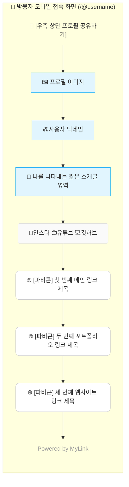
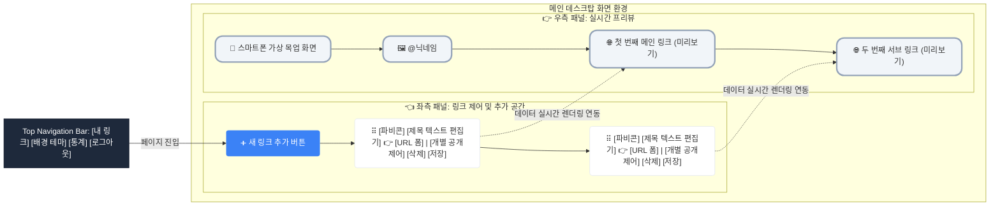

# 마이링크 (MyLink) - 와이어프레임 (Wireframe)

본 문서는 데이터 구조와 화면 배치를 한눈에 파악하기 위해 작성된 **'방문자용 프로필 화면(Public View)'**과 **'소유자용 관리자 대시보드(Admin Dashboard)'**의 다이어그램 레이아웃입니다. (초반의 랜더링 오류를 막기 위해 HTML 태그를 배제한 클린 버전입니다)

---

## 1. 방문자용 프로필 화면 (Public View)

스마트폰(Mobile) 환경에 최적화된 세로형 레이아웃입니다. 프로필 정보, SNS 전용 아이콘, 그리고 대상 타겟을 가리키는 텍스트 링크 버튼들이 직관적으로 배치됩니다.

---

## 2. 관리자 대시보드 화면 (Admin Dashboard)

웹 관리자 환경(Desktop/Tablet)을 기준으로 한 **화면 분할(Split) 레이아웃**입니다. 
- **좌측(Left):** 링크를 직접 추가/수정/삭제하는 메인 제어 공간.
- **우측(Right):** 변경 사항이 실제 방문자에게 어떻게 보일지 즉시 확인하는 라이브 프리뷰 공간.

---

### 💡 각 UI 디자인 요소별 세부 UX 설명 

#### 2.1 메인 제어 패널 (좌측)
* **드래그 앤 드롭 (`⠿` 아이콘)**: 마우스로 블록의 좌측 끝 그립 핸들을 잡고 위아래로 끌어당겨 시각적으로 링크 정렬 순서를 즉시 변경합니다.
* **빠른 인라인 편집**: 별도의 수정 팝업창을 띄우지 않고, 제목이나 주소 텍스트를 클릭 시 인풋(Input) 폼이 곧바로 활성화되어 쉽게 고칠 수 있도록 동선(UX)을 줄입니다.
* **삭제 즉시 피드백 토스트**: 휴지통 버튼을 눌러 링크 블록 삭제 시, 하단에 *'1개의 링크가 삭제되었습니다. [실행 취소]'* 라는 팝업 토스트(Toast)가 등장하여 위로 올라옵니다. 

#### 2.2 라이브 프리뷰 패널 (우측)
* **초단위 동기화 (Live Data Binding)**: 좌측 입력창에서 텍스트 타이핑을 단 한 글자라도 칠 때, 키보드에 맞추어 즉각적으로 우측 목업 화면의 버튼 텍스트가 동시에 변환되는 최신 트렌드의 인터랙션을 적용합니다.
* **고정형 스크롤(Sticky)**: 링크 목록이 매우 길어져 사용자가 휠을 નીચે(아래)로 길게 내려도, 우측의 스마트폰 프리뷰 컨테이너는 화면 밖으로 밀려 나가지 않고 항상 화면 안에 `position: sticky` 형태로 고정되어 따라다닙니다.
